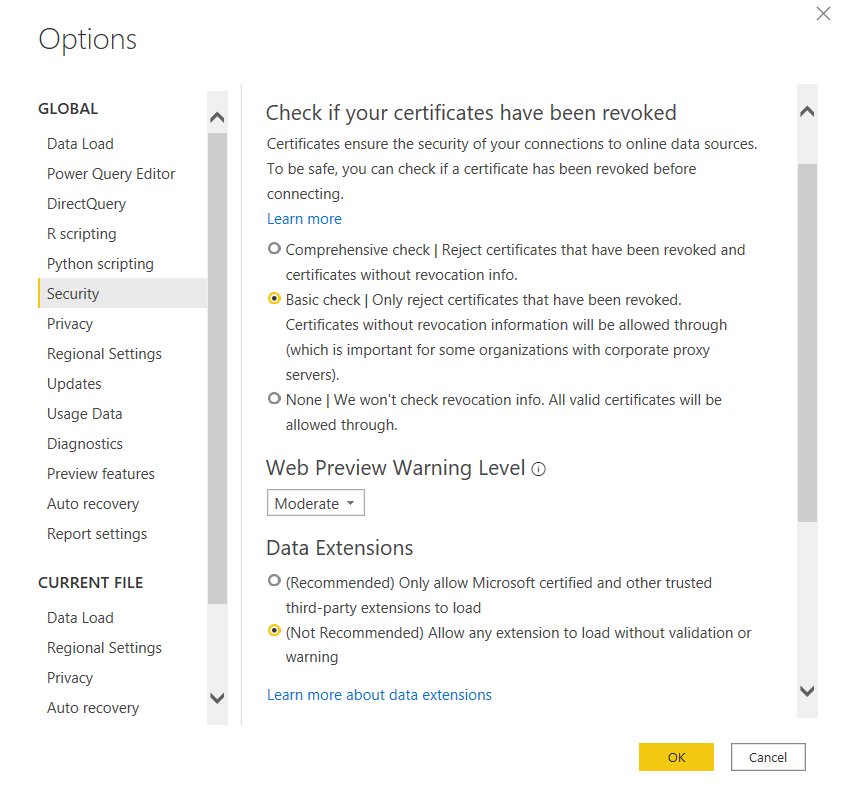
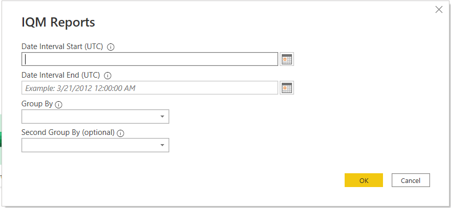
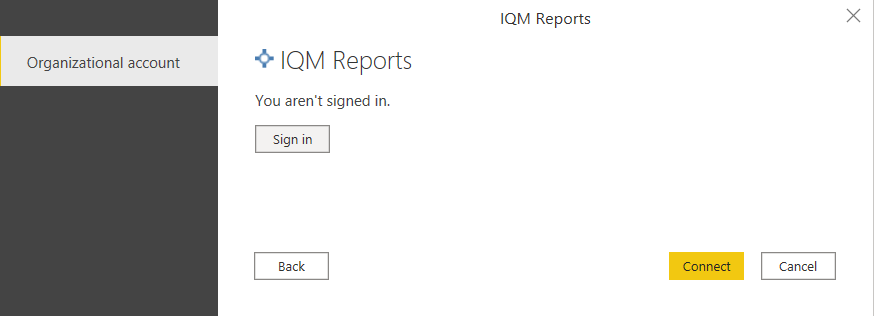
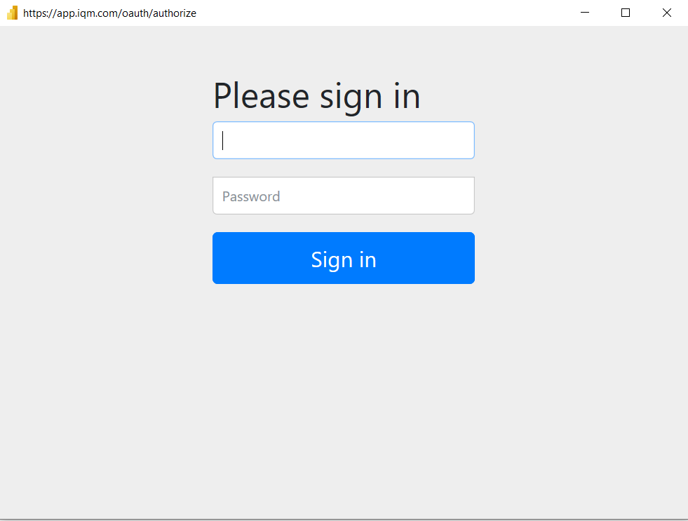
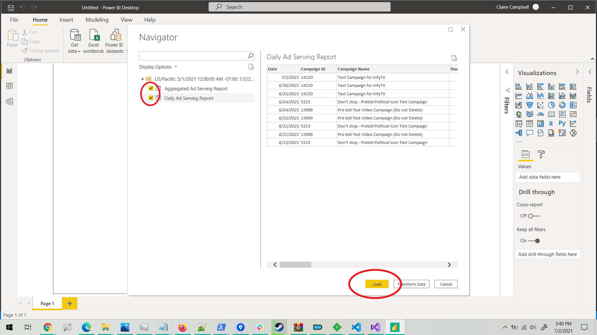

# IQM Reports Connector

## Overview

The IQM Reports connector for Power BI Desktop allows you to easily access your IQM campaign ad-serving data through the Power BI Desktop application.

## Prerequisites

Before you use this connector, you must have an IQM account. You must also have the Microsoft Power BI Desktop application installed.

## Installation

1. Download the IQM Reports.mez file from the bin&#92;Release directory in this repository.
2. Place the .mez file into the C:&#92;Users&#92;&lt;User_Name&gt;&#92;Documents&#92;Power BI Desktop&#92;Custom Connectors directory. If this directory does not exist, create it.
3. Open Power BI Desktop and navigate to the Options menu (File &gt; Options and settings &gt; Options). In the Security tab, under Data Extensions, check the option &#8220;(Not Recommended) Allow any extension to load without validation or warning&#8221;.

4. Click OK and restart Power BI Desktop.

## Connect to IQM Reports data

To retrieve data through the IQM Reports connector for use in Power BI Desktop, follow these instructions:

1. In the “Home” tab, click “Get Data” > “More”. 

2. In the “Get Data” dialog box, select the “Online Services” tab and click on the connector labeled “IQM Reports (beta)”. Click the “Connect” button at the bottom of the dialog.

3. Input the required parameters into the IQM Reports dialog and click “OK”.

4. Sign in using your IQM account. Click “Connect".

5. In the Navigator window, select the tables of data to import from the IQM Reports connector by checking the checkboxes next to each table you want to import. Then, click Load.

6. Power BI Desktop will retrieve ad-serving reporting data according to your inputs and convert them to tables that you can use to build reports!
